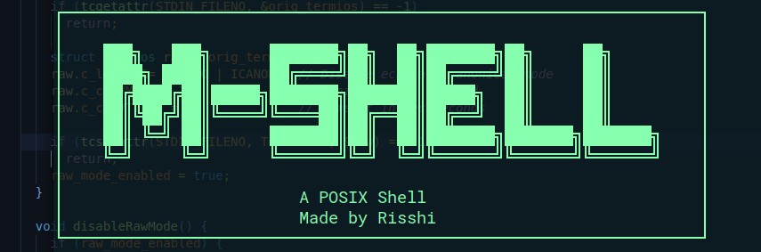

# 🐱 MShell


A modern, feature-rich POSIX-compliant shell implementation written in C++23.

## ✨ Features

- **Smart Tab Completion** - Trie-based command indexing with prefix matching
- **Command History** - Navigate with arrow keys (↑/↓)
- **I/O Redirection** - Full support for `>`, `>>`, `2>`, `2>>`, `1>`, `1>>`
- **Raw Terminal Mode** - Real shell-like experience
- **Finite State Machine Tokenizer** - Robust parsing with quote and escape support
- **Built-in Commands** - `echo`, `pwd`, `cd`, `exit`, `type`, `history`, `mshell`
- **PATH Discovery** - Auto-completion for system commands

## 🚀 Quick Start

```bash
# Clone the repository
git clone https://github.com/yourusername/shell-cpp.git
cd shell-cpp

# Build and run
./build.sh
```

## 🔧 Building Locally

**Prerequisites:**
- C++23 compatible compiler (GCC 13+ or Clang 15+)
- CMake 3.13+
- vcpkg (included as submodule)

**Build Steps:**
```bash
# Initialize vcpkg submodule
git submodule update --init --recursive

# Build with CMake
mkdir build && cd build
cmake .. -DCMAKE_TOOLCHAIN_FILE=../vcpkg/scripts/buildsystems/vcpkg.cmake
make

# Run the shell
./shell
```

## 🎯 Usage Examples

```bash
$ echo "Hello, World!"          # Built-in commands
$ ls -la                        # External commands  
$ echo "output" > file.txt      # I/O redirection
$ cat file.txt 2> error.log     # Error redirection
$ his<TAB>                      # Tab completion → history
$ <↑>                          # Command history
```

## 🔮 Future Plans

- [X] Signal handling (`Ctrl+C`, `Ctrl+Z`)
- [ ] Syntax highlighting
- [ ] Pipe support (`|`)
- [ ] Job control (`&`, `jobs`, `fg`, `bg`) 
- [ ] Configuration file support
- [ ] Plugin system for custom commands

## 📁 Project Structure

```
src/
├── main.cpp          # Terminal management & main loop
├── tokenize.cpp      # FSM-based tokenizer
├── builtins.cpp      # Built-in command implementations
├── search.cpp        # Trie-based command completion
├── history.cpp       # Command history management
└── util.cpp          # System utilities & PATH handling
```

## 🛠️ Technical Highlights

- **Finite State Machine** tokenizer for robust command parsing
- **Trie data structure** for efficient command completion
- **Raw terminal control** using termios for real-time input
- **Process management** with fork/exec for external commands
- **File descriptor manipulation** for I/O redirection
- **Modern C++23** features with memory-safe design patterns

---

Contributions are Welcome !
